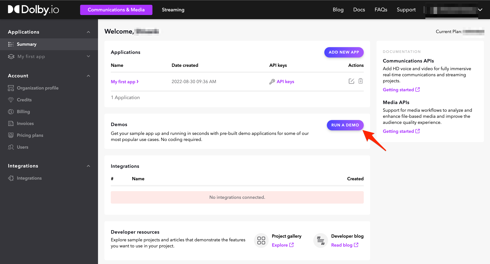
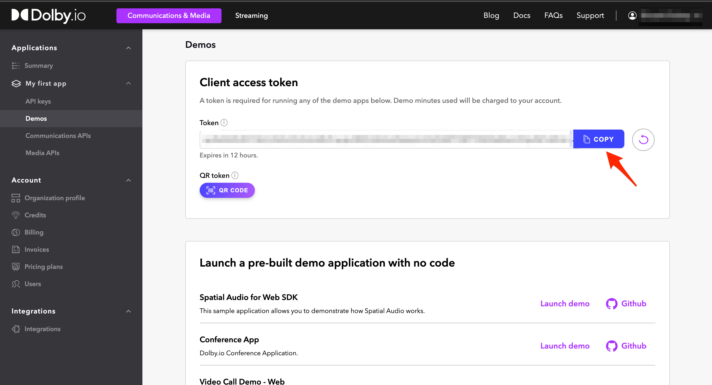

# Dolby.io Communications Video Call React App

## Video Call App

The application available in this repository demonstrates the capabilities of the Dolby.io video call solution for browser applications, built using React. If you run into problems, the full Dolby.io Communications SDK for JavaScript documentation can be found at <https://docs.dolby.io/communications-apis/docs/js-overview>.

You can download the repository yourself, run the application locally and verify that it meets your requirements. If you are interested in more details about Dolby.io video conference call capabilities, more information can be found here:
<https://dolby.io/products/video-call/>

The scope covers:

- Initialization of the Dolby.io SDK
- Creating and joining a conference
- Camera, microphone, and audio output configuration
- Full conference view with grid display of user streams
- Basic video conferencing interactions (muting, camera switching)
- Screen sharing
- Recording
- Background blur (available only on desktop Chrome and Edge)
- Music mode (available only on desktop Chrome and Edge)
- Live-streaming through the Dolby.io API after additional setup process [Using Live-streaming features](#using-live-streaming-features)

## Getting Started

The following steps will quickly get you started testing the Dolby.io Communications APIs capabilities.

### How to get a Dolby.io account

The Dolby.io Communications APIs requires you to create a Dolby.io account.
To set up your Dolby.io account, go to <https://dashboard.dolby.io/signup/> and complete the form. After confirming your email address, you will be logged in.

### Dolby.io dashboard

After logging in, you have access to the full dashboard where you can manage your account.

From this page <https://dashboard.dolby.io/dashboard/applications/summary> you can manage your profile and billing.

### How to obtain access token

To run the application, you need to generate an access token and paste it into the source code of the app.

1. Go to the _Dashboard_, and find the _Launch Demos_ button.
   

2. On the next screen, there is a token field where you can copy the client access token to your clipboard. The generated token is active for 12 hours.
   

## How to run the Video Conferencing app

The following details the steps required to run the application locally.

### Clone the repository

Use git to clone the repository with
`git clone git@github.com:dolbyio-samples/comms-app-react-videoconference.git`
or simply download using the green button on the top of this page and unzip the repository.

### Install dependencies

**note** : This guide is written with [Yarn](https://yarnpkg.com/) in mind.

Open the root directory with the terminal and install the dependencies with the following command:

```bash
yarn
```

### Paste the token

Open file [src/App.tsx](./src/App.tsx), find line 23 and replace `{YOUR_TOKEN}` with your access token string, prepared previously in [this step](#how-to-obtain-access-token). It should look like this:

```javascript
  return (
    <TranslationProvider>
      <ConferenceCreateProvider>
        <CommsProvider token="bGciOiJIUzUxMiJ9.eyJOTQxMywic3V...23r2fsdvsdfsfdsvfd">
          <...>
        </CommsProvider>
      </ConferenceCreateProvider>
    </TranslationProvider>
  );
```

### Start the app

After installing the dependencies, execute the following command:

```bash
yarn dev
```

to run the application locally.

### Open the app in a browser

After the appropriate message appears in the terminal window, open <http://localhost:3000> in the browser. The application will launch at this address.

## How to build the Video Conferencing app

Follow the steps of installing dependencies and token configuration from the "How to run the Video Conferencing app" section.

After installing the dependencies, execute the following command:

`yarn build`

This command generates distribution packages in the `/dist` directory.

### Base URL configuration

In the event that you need to serve production content from a path other than `/` root, (e.g. extend example.app to example.app/videoconference/) please add the `/.env.production` file with the following content:

```bash
BASE_URL=<YOUR BASE URL PATH>
```

Additional information about Base URL configuration can be found [here](https://vitejs.dev/config/shared-options.html#base).

### Setting up music mode

1. In the project root folder, add the following variable in `.env` file:

```env
VITE_MUSIC_MODE=true
```

2. To start the application run the following command in the **root** directory

```bash
yarn dev
```

### Using live streaming features

In order to use live streaming features, you need to run an additional proxy server so that POST methods can be properly handled. An example of such a server is placed in the [/api](api/) folder.

> If your application has been started in previous steps, please kill the process and proceed with instructions below.

#### Setting up live streaming

1. In the project root folder, create an `.env` file and add the following variables

```env
VITE_API_PROXY=localhost
VITE_PROXY_PORT=4000
VITE_PROXY_PROTOCOL=http
VITE_STREAMING=true
```

2. In the `/api` directory, create an `.env` file and fill it with the following properties.

```bash
PORT=4000
KEY=APP_KEY
SECRET=APP_SECRET
HOSTNAME=localhost
```

Your `APP_KEY` and `APP_SECRET` can be found in your Dolby.io dashboard, under the app section. **Do not** wrap them in quote marks.


3. Staying inside the `/api` directory, install all dependencies by running the following command

```bash
yarn
```

1. To start both the server and application together, run the following command in the **root** directory:

```bash
yarn run dev-proxy
```

> Ports and hostnames in both `.env` files can be set freely by the user but they need to be the same.

## Adding Custom layouts to your live stream

Please visit this [blog post](https://dolby.io/blog/creating-a-custom-mixer-layout-for-streaming-a-conference/) if you want to explore adding a custom layout to your live stream.

## Known issues and limitations

- Speaker selection is available only on Chrome
- The copy conference link works only for root directories by default
- In some cases entering a conference may take more than three seconds
- On Safari 15.4 and below, the local user can hear echo

## Requirements and supported platforms

### Video Conference Call App supports four main browsers

- Chrome 100+
- Safari 15+
- Firefox 100+
- Edge 100+
